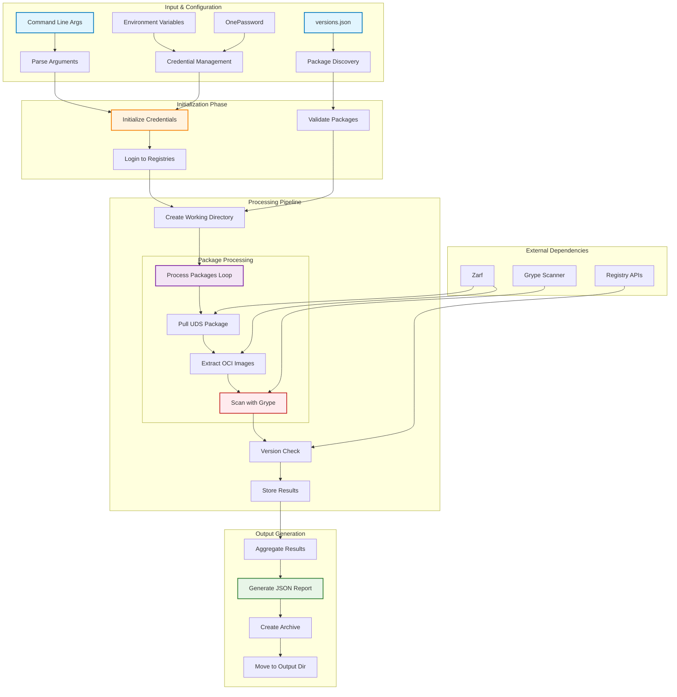
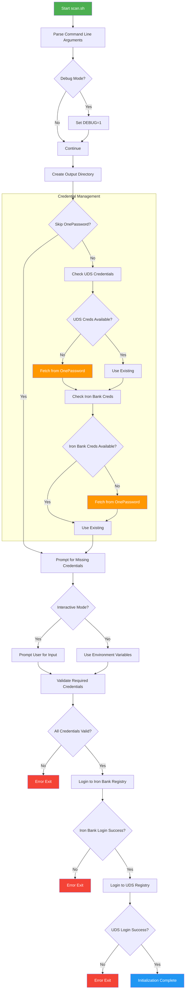
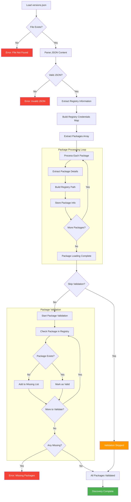
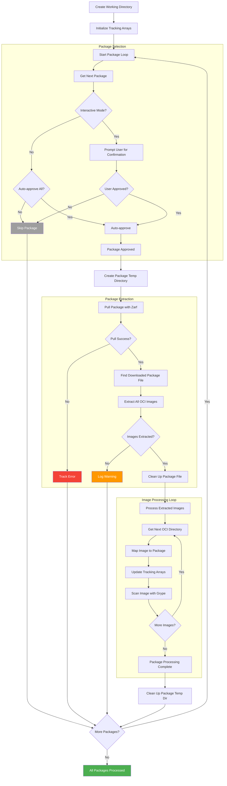
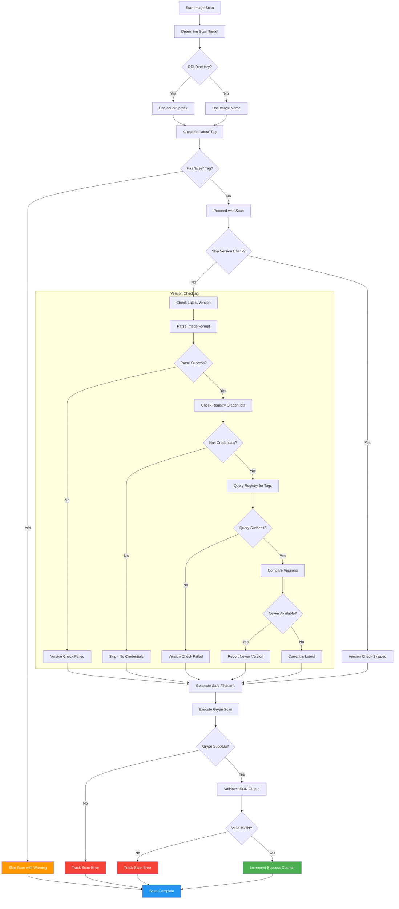
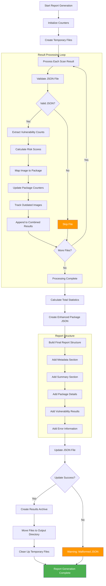
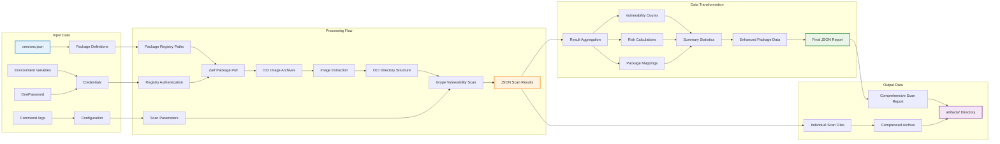
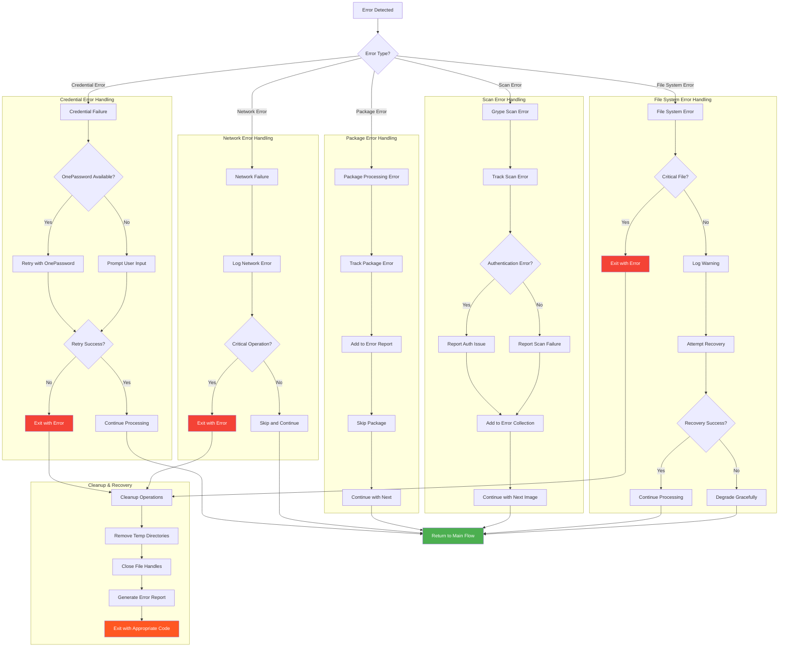

# UDS Vulnerability Scanner - Unified Execution Plan

## Overview

This document provides a comprehensive analysis and unified execution plan for the UDS vulnerability scanning script (`bin/scan.sh`). The script is a sophisticated 1,392-line Bash utility that scans UDS (Unicorn Delivery Service) packages for container image vulnerabilities using Grype.

## High-Level System Architecture



## API Interface Analysis

### Command-Line Interface

```bash
./scan.sh [OPTIONS]

OPTIONS:
  -h, --help              Show help message
  -d, --debug             Enable debug output
  --skip-op               Skip OnePassword credential retrieval
  --skip-version-check    Skip checking for newer image versions
  --skip-validation       Skip package registry validation
  -o, --output DIR        Output directory (default: artifacts/)
  --exclude-tags PATTERN Regex for tag exclusion (default: "(sha256|nightly|arm64|latest|ubi)")
  --arch ARCH            Architecture to scan (default: amd64)
  -y, --yes              Auto-approve all packages (non-interactive)
  --no-interactive       Disable interactive prompts
```

### Configuration Files

**versions.json Structure:**

```json
{
  "packages": [
    {
      "name": "package-name",
      "version": "1.2.3-uds.0-unicorn",
      "environments": ["dev", "staging", "prod"]
    }
  ],
  "registries": [
    {
      "name": "registry1",
      "url": "registry1.dso.mil",
      "hasCredentials": true
    }
  ]
}
```

### Environment Variables

```bash
UDS_USERNAME/UDS_PASSWORD           # UDS registry credentials
IRONBANK_USERNAME/IRONBANK_PASSWORD # Iron Bank credentials
UDS_URL                             # Registry URL (default: registry.defenseunicorns.com)
ORGANIZATION                        # Target organization (default: sld-45)
```

### Output Formats

- **Individual Scan Files**: JSON files per image (from Grype)
- **Combined Report**: `scan-results-{timestamp}.json` with comprehensive metadata
- **Archive**: Compressed tarball of all results
- **Console Output**: Real-time colored progress and status updates

## Technical Architecture

### Key Implementation Patterns

```bash
# Global tracking arrays (declared with -g/-gA flags)
declare -gA image_to_package            # Maps images to package JSON
declare -gA image_to_oci_dir            # Maps images to extracted OCI directories  
declare -gA oci_dir_to_image            # Reverse mapping for OCI processing
declare -gA image_latest_versions       # Version check results
declare -gA registry_has_credentials    # Registry authentication status
```

### Security Features

- **Credential Management**: OnePassword integration with secure fallbacks
- **Registry Authentication**: Secure login using Zarf
- **Package Validation**: Pre-flight verification of package existence
- **Safe File Handling**: Secure filename generation and cleanup

### Performance Optimizations

- **Sequential Processing**: One package at a time with immediate cleanup
- **Temporary Directory Isolation**: Per-package workspace management
- **Memory Efficiency**: Direct OCI scanning without registry push/pull
- **Selective Operations**: Credential-aware version checking

## Unified Execution Plan

## Phase 1: Initialization & Pre-flight Checks



**Key Activities:**

- Parse and validate command-line arguments
- Initialize debug and output settings
- Manage credentials through OnePassword or environment variables
- Authenticate with UDS and Iron Bank registries
- Validate all prerequisites before proceeding

**Dependencies:** OnePassword CLI (optional), Zarf, network connectivity

## Phase 2: Package Discovery & Validation



**Key Activities:**

- Load and parse `versions.json` configuration file
- Extract package definitions and registry mappings
- Build credential awareness map for registries
- Validate package (with version) existence in registries
- Prepare package list for processing

**Data Structures:**

- Registry path construction: `$UDS_URL/$ORGANIZATION/$pkg_name:$pkg_version`
- Global arrays for packages and package_info
- Registry credentials mapping

## Phase 3: Package Processing Pipeline



**Key Activities:**

- Interactive or automated package approval workflow
- Package pulling using Zarf OCI operations
- Container image extraction from package archives
- Immediate cleanup to minimize disk usage
- Parallel tracking of image-to-package relationships

**Resource Management:**

- Per-package temporary directories
- Immediate cleanup after image extraction
- Memory-efficient processing patterns

## Phase 4: Vulnerability Scanning & Analysis



**Key Activities:**

- Direct scanning of OCI directories with Grype
- Intelligent version pattern matching and comparison
- Registry API queries for latest version information
- Comprehensive error handling for scan failures
- Risk score calculation and vulnerability aggregation

**Version Analysis:**

- Pattern recognition for semantic versioning
- FIPS-aware version filtering
- Architecture-specific tag handling
- Graceful degradation for parsing failures

## Phase 5: Report Generation & Output



**Report Structure:**

```json
{
  "metadata": {
    "scanTimestamp": "2024-01-15T10:30:00Z",
    "scanDurationSeconds": 1847,
    "totalImagesScanned": 45,
    "successfulScans": 42,
    "failedScans": 3,
    "grypeVersion": "0.73.4"
  },
  "summary": {
    "packages": [...],
    "totalPackages": 18,
    "vulnerabilitiesBySeverity": {
      "critical": 12,
      "high": 34,
      "medium": 156,
      "low": 89,
      "negligible": 23,
      "unknown": 5
    },
    "totalVulnerabilities": 319,
    "fixableVulnerabilities": 284,
    "unfixableVulnerabilities": 35,
    "totalRisk": 1250.5,
    "errors": [...]
  },
  "results": [...]
}
```

## Data Flow Architecture



## Error Handling & Recovery



## Critical Dependencies & Requirements

### External Tools

- **Zarf**: Package operations and registry authentication
- **Grype**: Vulnerability scanning engine
- **jq**: JSON processing and manipulation
- **OnePassword CLI**: Optional credential management

### System Requirements

- Bash 4.0+ with associative array support
- Sufficient disk space for temporary OCI image storage
- Network connectivity to UDS and Iron Bank registries
- Write permissions for artifacts directory

### Configuration Requirements

- Valid `versions.json` with package definitions
- Registry credentials (OnePassword, environment variables, or interactive)
- Appropriate architecture selection (amd64/arm64)

## Key Technical Strengths

1. **Robust Error Handling**: Package-level failures don't stop entire scans
1. **Security-First Design**: Secure credential management with multiple fallback options
1. **Performance Optimized**: Sequential processing with immediate cleanup to minimize resource usage
1. **Enterprise Ready**: Support for multiple registries, architectures, and FIPS compliance
1. **Comprehensive Reporting**: Detailed vulnerability attribution back to specific packages and environments
1. **Interactive & Automated**: Flexible execution modes for different use cases

## Usage Examples

### Basic Interactive Scan

```bash
./bin/scan.sh
```

### Automated Non-Interactive Scan

```bash
./bin/scan.sh -y --skip-op --output /tmp/scan-results
```

### Debug Mode with Custom Architecture

```bash
./bin/scan.sh --debug --arch arm64 --exclude-tags "(nightly|rc)"
```

### Skip Version Checking for Faster Scans

```bash
./bin/scan.sh --skip-version-check --skip-validation
```

This unified execution plan provides a comprehensive framework for understanding and operating the sophisticated UDS vulnerability scanning system, enabling both operational use and further development.
